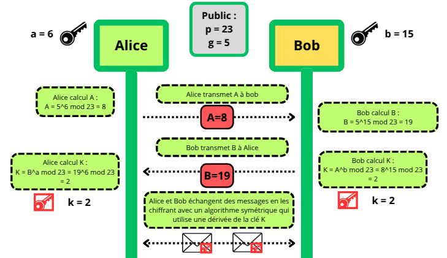

# Diffie-Hellman

## Introduction 

    Whitfield Diffie et Martin Hellman, deux chercheurs de l'Université de Stanford, publient *"New Directions in Cryptography"* en 1976. Cet article révolutionne la cryptographie en introduisant le concept de cryptographie asymétrique. Dans cet article nous allons voir comment se met en place une communication sécurisée via le protocole d'échange de clés Diffie-Hellman.

## Intérêt de Diffie-Hellman :

L'objectif du protocole de Diffie-Hellman est de permettre à 2 acteurs qui ne se connaissent pas de s'accorder sur un secret commun en utilisant un canal potentiellement espionné par un acteur tiers.

Une analogie sur Wikipédia permet d'introduire l'idée mathématique derrière ce protocole. Nous nous attacherons dans cet article qu'à cet aspect mathématique, mais vous pouvez trouver l'analogie ici :

[Échange de clés Diffie-Hellman — Wikipédia](https://fr.wikipedia.org/wiki/%C3%89change_de_cl%C3%A9s_Diffie-Hellman)

## Principe mathématique :

Deux entités, **Alice** et **Bob**, souhaitent échanger sur un canal sécurisé mais ne possèdent pas de secret partagé entre eux.

Deux valeurs `p` et `g` sont **publiques** et connues de tous (même d'un potentiel espion sur le canal). 

- `p` est un grand nombre premier, il doit être suffisamment grand pour assurer la sécurité (**au moins 2048 bits aujourd’hui**).  
- `g` est un nombre strictement inférieur à `p`, appelé **base** ou **générateur**. C’est un entier tel que ses puissances modulo `p` génèrent un grand nombre de valeurs possibles.  

Ces valeurs sont :

- soit déjà connues par les deux entités, par exemple dans le cas de la mise en place d'une session **TLS**, les 2 entités vont choisir un **MODP group** commun dans la [RFC 3526](https://datatracker.ietf.org/doc/html/rfc3526#page-3).  
  Le MODP group contient une valeur fixe pour `p` et `g`. La valeur et la longueur de `p` changent selon le MODP group :

    | Groupe | Taille de `p` (bits) | g | Usage |
    |--------|----------------------|---|-------|
    | 14     | 2048                 | 2 | TLS, VPN, SSH |
    | 15     | 3072                 | 2 | TLS, applications à sécurité élevée |
    | 16     | 4096                 | 2 | TLS très sécurisé |
    | 17     | 6144                 | 2 | TLS très sécurisé |
    | 18     | 8192                 | 2 | TLS très sécurisé |

- soit partagées par l'initiateur de l'échange (client). C'est une situation plutôt expérimentale et rarement utilisée en production.

Deux autres valeurs `a` et `b` sont **privées**, et appartiennent respectivement à Alice et à Bob.  
- Alice est la seule qui connaît `a`.  
- Bob est le seul qui connaît `b`.  

Chaque participant utilise son secret pour calculer une valeur publique à envoyer à l’autre :

- Alice : `A = g^a mod p` (valeur publique d’Alice)  
- Bob : `B = g^b mod p` (valeur publique de Bob)  

Ces valeurs `A` et `B` sont ensuite transmises sur un canal public, sans risque car la sécurité repose sur le **problème du logarithme discret** : retrouver `a` à partir de `A` est très difficile si `p` est grand.

Ensuite :

- Alice reçoit `B` de la part de Bob  
- Bob reçoit `A` de la part d'Alice  

Puis chacun combine la valeur publique reçue avec son secret privé pour trouver la clé `K` :

- Alice : `K = B^a mod p`  
- Bob : `K = A^b mod p`  

Ainsi, la clé `K` est la même pour Alice et Bob grâce à la propriété :

```
(B^a mod p) = (A^b mod p) = g^(ab) mod p
```

## Exemple pratique :

Dans cet exemple, les valeurs sont volontairement faibles pour illustrer le mécanisme.  
En pratique, **les clés doivent avoir une taille d’au moins 2048 bits**.



**Paramètres publics :** `p = 23`, `g = 5`

- Alice choisit sa clé privée `a = 6` et calcule `A` :
  ```
  A = 5^6 mod 23 = 15625 mod 23 = 8
  ```
- Bob choisit sa clé privée `b = 15` et calcule `B` :
  ```
  B = 5^15 mod 23 = 30517578125 mod 23 = 19
  ```

Échange :
- Alice envoie `A = 8` à Bob  
- Bob envoie `B = 19` à Alice  

Calcul de la clé partagée :
- Alice : `K = B^a mod 23 = 19^6 mod 23 = 2`  
- Bob : `K = A^b mod 23 = 8^15 mod 23 = 2`  

La clé partagée finale est donc : `K = 2`

### Utilisation de la clé K :

Tous les messages qui suivent seront chiffrés et déchiffrés par cette même clé `K`, **comme dans le cas d'un chiffrement symétrique**.  

Par exemple, `K` est dérivée via une **fonction de dérivation de clé (KDF)** pour obtenir :  

- une clé AES pour le chiffrement,  
- et éventuellement une clé d’intégrité.  

Les messages sont alors chiffrés avec AES, transmis, puis déchiffrés avec la clé dérivée correspondante.

## Limites et perspectives :

Tout ce protocole repose sur le **problème du logarithme discret** :  
- Même en connaissant `A`, `g` et `p`, il est pratiquement impossible de retrouver `a` si `p` est grand.  
- « Pratiquement impossible » car avec une puissance de calcul immense et un temps extrêmement long (millions d'années), un ordinateur **classique** pourrait finir par casser le secret.  

Cependant, l’avènement de l’informatique quantique pourrait permettre de résoudre ce problème beaucoup plus rapidement, rendant le protocole vulnérable même avec de très grandes valeurs pour p et les secrets privés. Se pose alors la question de la Cryptographie post-quantique : `Comment développer des algorithmes résistants aux attaques quantiques ?`
