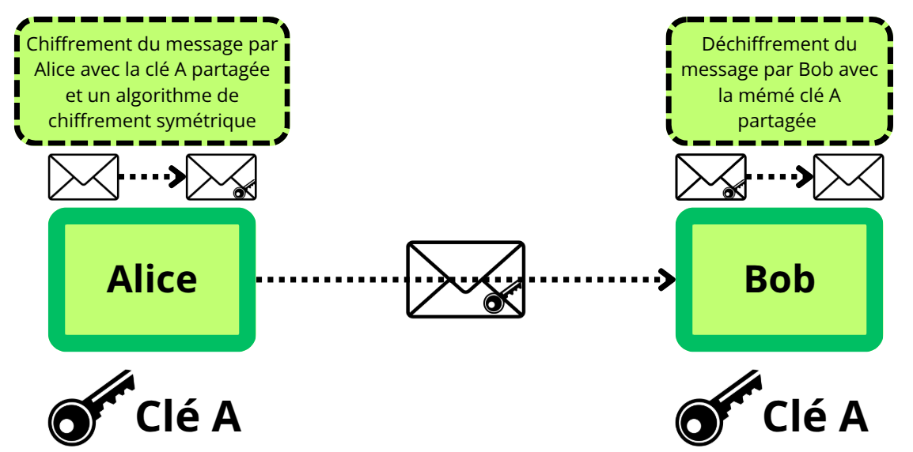
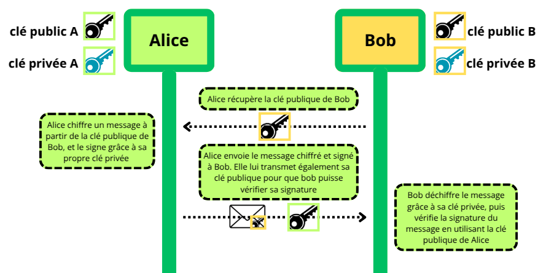

# PKI - Public Key Infrastructure

## Introduction

    Une PKI (Public Key Infrastructure) est un ensemble de technologies permettant de gérer des certificats numériques et des clés cryptographiques.  
    Dans cet article, nous verrons comment s'est développé le besoin d'une telle architecture, ce qu'est un certificat et comment fonctionnent les mécanismes de délivrance et de validation de certificat.

## Des premiers chiffrement à la PKI

Jusqu'aux années 70, les communications sécurisées (pour celles qui l’étaient !) utilisaient très majoritairement le **chiffrement symétrique** :   Les deux acteurs de l'échange possèdent une clé secrète commune qui permet de chiffrer et déchiffrer toutes les communications.

Le problème principal que pose cette méthode de chiffrement est la **distribution des clés** :   Comment partager la clé secrète qui permet de chiffrer toutes les communications entre deux utilisateurs ?

=> Si la clé est partagée en clair et interceptée, le chiffrement ne sert plus à rien.

Il est donc nécessaire de trouver un moyen de sécuriser l'échange de clé, via une rencontre physique ou un canal déjà sécurisé, ce qui réduit l'efficacité du chiffrement à grande échelle (par exemple, impossibilité d'échanger des clés entre deux acteurs qui ne se connaissent pas encore).

En **1976**, *Whitfield Diffie* et *Martin Hellman*, deux chercheurs de l’Université de Stanford, publient *New Directions in Cryptography*. Cet article révolutionne la cryptographie en introduisant un nouveau concept : le **chiffrement asymétrique** (ou chiffrement à clé publique).  
Nous ne détailleront pas ici le fonctionnement de Diffie-Hellman, mais j'ai écrit un petit article sur le sujet si il vous intérésse.

[Diffie Hellman](diffie_hellman)

Un an après, en **1977**, trois chercheurs américains, *Ron Rivest, Adi Shamir et Leonard Adleman*, publient l'algorithme **RSA** (RSA pour *Rivest–Shamir–Adleman*). C’est l’un des premiers algorithmes de chiffrement asymétrique pratiques :  Il permet de chiffrer et déchiffrer des messages en utilisant une paire de clés distinctes (publique/privée), et également d'ajouter une **signature numérique** pour authentifier l'auteur du message.

Avec RSA, les deux acteurs de l'échange possèdent chacun deux clés :  ne clé puublique et une clé privée. Les deux clés sont différentes mais mathématiquement liées : la clé publique permet de chiffrer des messages que seule la clé privée peut déchiffrer. La 

Ainsi, le problème de la compromission de la clé de chiffrement publique n'en est plus un, car cette information est, par définition, publique.  
L'acteur A, lorsqu'il souhaite communiquer avec B, demande à obtenir la **clé publique** de B. Il utilise ensuite cette clé pour chiffrer les messages qu'il envoie à B. B utilise sa **clé privée**, qu'il est le seul à posséder, pour déchiffrer les messages.

Pour plus de détails, voir cet article sur RSA : [Introduction à RSA](RSA)

## Le problème de l’authenticité des clés

Le chiffrement asymétrique règle le problème du partage de la clé, mais pose cependant un nouvel enjeu :

**Comment être sûr que la clé publique reçue dans le cadre de la mise en place du chiffrement asymétrique appartient bien à Bob et non à un attaquant (attaque de l’homme du milieu, ou MITM) ?**

Ce sont les concepts de **certificat** et de **signatures numériques** qui vont venir répondre à cette problématique.

Un **certificat numérique** atteste l’identité d’un détenteur de clé publique.  
Il contient notamment : 
- la clé publique  
- l’identité du propriétaire  
- une durée de validité  
- la signature d’une **autorité de certification (CA)**  

Le format de certifiat le plus largement adopté est le certificat x.509. J'ai écrit un petit article sur son format, que je vous recommande de lire avant de continuer : 

[Certificats x509](certificat_x509)

La signature de la CA permet à n’importe quel utilisateur de vérifier que la clé publique appartient bien au propriétaire indiqué et non à un attaquant,  
ce qui protège contre les attaques de type MITM. 

Les **signatures numériques** permettent d’authentifier l’auteur d’un message et de garantir son intégrité. Elle est calculé à partir d'une emprunte (hash) du message (ici, du certificat) et de la clé privée du signataire. Elle est ensuite vérifier grace à la l'emprunte de message et la `clé publique` du signataire.

Si le message est modifié après sa signature, la vérification échoue,  ce qui assure que le contenu reçu n’a pas été altéré.

## La PKI

La **PKI (Public Key Infrastructure)** est une infrastructure complète qui organise et sécurise l’utilisation des certificats et des clés publiques.  
Elle fournit plusieurs services :

- **Création et émission de certificats** par les CA (Certificate Authorities)  
- **Révocation de certificats** compromis ou expirés via **CRL (Certificate Revocation List)** ou **OCSP (Online Certificate Status Protocol)**  
- **Validation de certificats** pour les utilisateurs ou applications  
- **Gestion d'une hiérarchie de confiance**, incluant les CA racines et intermédiaires ainsi que les politiques de certification  

Grâce à la PKI, lorsqu’Alice souhaite communiquer avec Bob,  elle peut vérifier la clé publique de Bob à travers son certificat signé par une CA.  
Un attaquant ne peut pas créer un certificat valide pour sa propre clé sans posséder la clé privée de la CA, ce qui rend une attaque de type MITM impossible. 

Violet : Création et validation de certificats.
Vert : Mise en place d'une session chiffrée et échange de données.

Ainsi,  Alice est certaine que la clé publique utilisée pour chiffrer le message est celle de Bob 

## Architecture de la PKI

La PKI est composée de différentes autorités qui possèdent leurs rôles respectifs :  

**Autorité de Certification (CA - Certificate Authority)**

C'est le composant central de la PKI : La CA émet, signe et révoque les certificats numériques. Elle garantit que la clé publique d’un certificat appartient bien à l’entité identifiée.  

On peut distinguer 2 types de CA :  

**Racine (Root CA)** : Elle sert de point de confiance ultime, souvent hors ligne pour une sécurité maximale.  

**Intermédiaire (Intermediate CA)** : Elle émet des certificats pour les utilisateurs ou services sans exposer directement la racine.  

Cependant, bien que la CA signe le certificat, ce n'est pas elle qui vérifie l'identité de l'entité qui émet une demande de certificat (CSR).  

**Autorité d’Enregistrement (RA - Registration Authority)**  : C'est justement le rôle de la RA : elle vérifie l’identité des entités qui demandent un certificat avant que la CA n’émette le certificat. Cette vérification peut prendre plusieurs formes : vérification de documents officiels (CNI, passeport, …), validation par email pour prouver que le demandeur contrôle le domaine, ...  

Selon la taille et la modernité de la PKI, on peut également trouver d'autres types d'autorité :  

**Validation Authority (VA)** : Elle est chargée de vérifier le statut des certificats en temps réel. Elle utilise différentes sources pour effectuer cette vérification :  

- **CRL (Certificate Revocation List)** 
- **OCSP (Online Certificate Status Protocol)**   

La VA peut fournir des réponses signées garantissant l’authenticité du statut du certificat.  

En plus de ces autorités, on retrouve des composants clés dans l'architecture PKI pour la gestion des certificats :  

- **Les certificats numériques**, comme les [Certificats x509](certificat_x509). Ils contiennent la clé publique d’une entité, son identité, la période de validité, et la signature de la CA.  

- **Base de données de certificats** : Stocke les certificats émis, révoqués et expirés. Utilisée par la CA pour gérer le cycle de vie des certificats.  

- **CRL (Certificate Revocation List)** : C'est la liste des certificats révoqués avant leur date d’expiration. Distribuée régulièrement pour informer les clients.  

- **OCSP (Online Certificate Status Protocol)** : Il permet de vérifier en temps réel le statut d’un certificat (valide, révoqué, inconnu) sans télécharger toute la CRL.  

Enfin, on retrouve des composants de sécurité de la PKI :  

**HSM (Hardware Security Module)**  : Un dispositif matériel qui stocke et protège les clés privées de la CA. Il garantit que les clés ne peuvent pas être volées ou compromises. Il faut bien voir que la clé privée de la root CA est un secret extrêmement critique. Si elle est compromise, toute la PKI est compromise.  

**CP (Certificate Policy)** : Un document qui définit les règles et conditions pour l’émission et l’utilisation des certificats.  

**CPS(Certification Practice Statement)**   : Il décrit comment la PKI implémente concrètement la politique de certification.

Voyons à présent comment ces éléments échangent pour créer, émettre, valider et révoquer des certificats :  

## Emission de certificats

### 1️ - Génération de la paire de clés

Le client génère une paire de clés asymétriques.  

### 2️ - Création de la CSR (Certificate Signing Request)
Le client crée une CSR. Elle contient :  
- La clé publique du client  
- Des informations d’identité (CN, O, OU, email, DNS, etc.)  
- Une signature avec sa clé privée  

### 3️ - Soumission à la RA (Registration Authority)
Le client envoie la CSR à la RA. Elle va vérifier son identité avec différentes méthodes :  
- Vérification des documents officiels (CNI, passeport, etc.)  
- Validation de la possession du domaine pour certificats SSL/TLS  
- Vérification par email ou téléphone selon CP/CPS  

Si la vérification réussit, elle transmet ensuite la CSR à la CA.  

### 4️ - Vérification et application des politiques par la CA

La CA vérifie la signature de la CSR et applique des  [politiques de certification (CP)](https://www.ietf.org/rfc/rfc3647.txt) et les CPS (Certification Practice Statement).  

Les CP décrivent les règles d’émission de certificats ; elles peuvent concerner :  
- La **gestion des clés** (longueur des clés, algorithmes acceptés, durée de vie des certificats)  
- La **politique de révocation**  
- Les **usages autorisés** des certificats  
- Les **exigences de vérification d’identité**  

Les **CPS**  précisent comment ces règles sont mises en œuvre concrètement par l’autorité de certification et la RA :  
- Procédures d’enrôlement
- Sécurisation des clés 
- Gestion opérationnelle

La CA génère un certificat X.509 à partir de la CSR et de ces informations.  

### 5 - Émission du certificat X.509
La CA émet le certificat X.509.  
Ce certificat contient :  
- La clé publique du client  
- Les informations d’identité associées (nom, organisation, domaine, adresse de messagerie selon le type de certificat)  
- La période de validité 
- Les extensions X.509 (si v3) : KeyUsage, ExtendedKeyUsage, Subject Alternative Name, politiques de certification, etc.  

Le certificat est signé par la CA à l’aide de sa clé privée, afin que d’autres entités puissent vérifier son authenticité et son intégrité avec la clé publique de la CA.  

La CA archive ce certificat dans sa base interne. Elle peut également publier ces certificats dans un repository (HTTP, LDAP, autre annuaire PKI…) et dans une VA (Validation Authority) , avec des informations de révocation(CRL ou OCSP) afin que d'autre entités puissent les récupérer et valider leur statut.  

### 6 -  Distribution au client
Le client reçoit son certificat.  
Il le stockera selon l’usage :  
- Dans un **keystore**  
- Dans un **navigateur**  
- Dans une **application**  

## Cas d'usage du certificat

Maintenant que le client à son certificat, plaçons-nous dans le cas où un serveur exige de l'authentification mutuelle TLS (mTLS) dans le cadre d'un serveur d'entreprise.

[=> Author](https://www.linkedin.com/pulse/lets-understand-mtls-working-mechanism-shashank-abhishek/)
### 1 et 2 : Initiation de la connexion TLS

- Le client initie une connexion TLS vers le serveur web avec `ClientHello` qui contient :
  - Versions TLS supportées
  - Suites cryptographiques
  - Extensions
- Le serveur répond avec `ServerHello` qui contient :
  - Version TLS choisie
  - Suite cryptographique choisie

### 3 et 4 : Authentification du serveur

- Le serveur envoie son certificat X.509 au client pour authentification.
- Le client vérifie :
  - La signature du certificat avec la clé publique de la CA (authenticité)
  - Que le certificat de la CA est présent dans sa **liste de confiance (trusted root)**
  - L’état du certificat via **OCSP** ou **CRL** fourni par la VA

### 5 : Authentification du client (mTLS)

- Le client envoie son certificat au serveur
- Le serveur effectue les mêmes vérifications que le client :
  - Signature du certificat avec la clé publique de la CA
  - Présence du certificat de la CA dans sa liste de confiance
  - Vérification de l’état via OCSP ou CRL

### 6 : Échange de la clé symétrique

- Le client envoie une **clé de chiffrement symétrique** (pré-master secret) qui sera dérivée et utilisée pour chiffrer les communications entre le client et le serveur

### 7 et 8 : Vérification de l’intégrité du handshake

- Chaque côté (client et serveur) calcule un **HMAC** sur tous les messages échangés depuis le début du handshake (`ClientHello`, `ServerHello`, certificats, clés, etc.)
- Les deux parties s’échangent cette valeur pour :
  - Vérifier l’intégrité de tous les messages échangés
  - Confirmer qu’elles possèdent la **même clé de session**

### 9 : Communication sécurisée

- Le client et le serveur peuvent maintenant **échanger des données chiffrées** avec la clé de session symétrique dérivée

## La PKI dans le contexte 5G

    La PKI joue un rôle essentiel dans l’authentification et dans la gestion des identités numériques au sein de l’infrastructure 5G. 

Contrairement aux générations précédentes de réseaux mobiles, la 5G introduit une architecture cloud-native et service-based (SBA), où de nombreuses Network Functions (NFs) doivent communiquer de manière sécurisée via des API exposées au sein du cœur de réseau. Pour cela, chaque fonction réseau se voit attribuer un certificat X.509 délivré par une PKI interne à l’opérateur permettant de :

- d’authentifier les entités (NFs, gNodeB, AMF, SMF, etc.),

- chiffrer les communications (TLS/HTTPS, pour rappel, les communications inter-NFs sont en HTTP2) et de garantir leur intégrité.

- gérer la révocation/renouvellement via des protocoles comme CMP (Certificate Management Protocol).

Le standard 3GPP mentionne l’usage de la PKI dans plusieurs spécifications comme la [TS 33.310](https://www.etsi.org/deliver/etsi_ts/133300_133399/133310/18.07.00_60/ts_133310v180700p.pdf) qui définit notamment les aspects de sécurité liés à l’accès et à l’enrôlement des certificats.

La PKI constitue la colonne vertébrale de la confiance dans les réseaux 5G, nous y dediront prochainement un article.
 