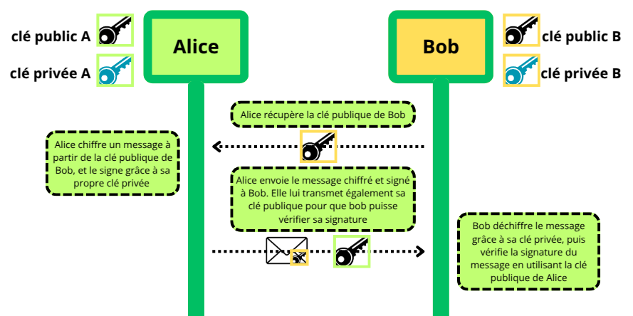
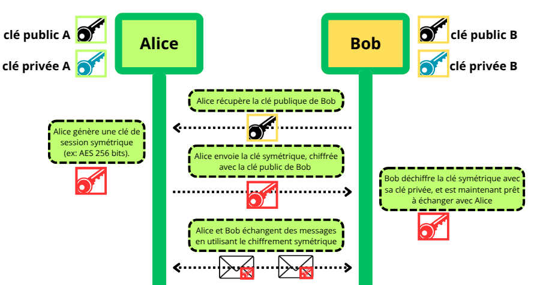

# RSA 

## Introduction

    En 1977, trois chercheurs américains, Ron Rivest, Adi Shamir et Leonard Adleman, publient l’algorithme RSA, nommé d’après leurs initiales.  

        Contrairement à Diffie-Hellman, qui introduisait un protocole d’échange de clé sans offrir un système complet de chiffrement, RSA constitue l’un des tout premiers systèmes de chiffrement asymétrique pratiques et complets, permettant à la fois le chiffrement et la signature numérique.  

        Il repose sur la difficulté de la factorisation de grands nombres premiers et demeure aujourd’hui encore l’un des algorithmes les plus connus et les plus utilisés en cryptographie.

    Dans cet article nous verront comment fonctionne RSA, les mathématiques derriere cet algorythme et ses usages. 

[Diffie-Hellman](Diffie_Hellman.md)

## Le chiffrement asymétrique


Le chiffrement asymétrique vient répondre au problème majeur du chiffrement symétrique : le partage des clés.

Pour rappel, le chiffrement symétrique fonctionne avec une seule clé, partagée par les deux entités qui souhaitent échanger des informations. Cette clé sert à chiffrer et déchiffrer les messages.

La question que pose le chiffrement symétrique est : Comment transmettre la clé permettant à Bob de déchiffrer le message ?


Les algorithmes asymétriques viennent répondre à cette question **en utilisant une paire de clés distinctes** : une clé publique pour chiffrer le message et une clé privée pour le déchiffrer. Ainsi, la clé privée ne quitte jamais son propriétaire, ce qui élimine le risque lié à l’échange de la clé secrète. La clé publique elle, peut être partagée et connue de tous.

Nous allons voir comment ces clés sont générés et mathématiquement liées. 

## Création des clés

Le client (Alice) et le serveur (Bob) génèrent une paire de clés.  
Cette paire de clés sera réutilisée pour les prochains chiffrements, et n'est renouvelée qu'en cas de compromission ou par précaution au bout d'un certain temps.

### Étapes de la création :

1. Choisir 2 nombres premiers distincts `p` et `q`
2. Calculer leur produit `N = p * q`, appelé module de chiffrement

> `p` et `q` sont **privés** et très grands (≤ 1024 bits), mais leur produit `N` est **public**.  
> Factoriser un `N` très grand pour retrouver `p` et `q` est pratiquement impossible avec les ordinateurs classiques.

3. **Choisir l’exposant public** `e`

`e` doit être un entier **premier avec** `(p-1)*(q-1)`, noté **φ(N)** (fonction d'Euler).  
`e` fait partie de la **clé publique** `(N, e)`.

4. **Calculer l’exposant privé** `d`

`d` est l’**inverse de e modulo (p-1)*(q-1)**, il fait partie de la **clé privée** `(N, d)`.  
Il est calculé avec l’**algorithme d’Euclide étendu**, c’est-à-dire trouver un `d` tel que :

```text
d * e ≡ 1 (mod φ(N))
```

**Résumé des clés :**

- **Clé publique (N, e)** : partagée avec tout le monde
- **Clé privée (d)** : gardée secrète par le propriétaire

### Exemple concret

1. Alice choisit 2 nombres premiers distincts :

```text
p = 5
q = 11
```

2. Calculer le module de chiffrement `N`

```text
N = p * q = 5 * 11 = 55
```

3. Calculer φ(N)

```text
φ(N) = (p-1)*(q-1) = 4 * 10 = 40
```

4. Choisir l’exposant public `e`

```text
1 < e < φ(N)
pgcd(e, φ(N)) = 1
```

On choisit **e = 3**, car `pgcd(3, 40) = 1`

5. Calculer l’exposant privé `d`


`d` est normalement calculé grace à l'algorythme d'euclide etendu, mais on peut le calculer à la main par tatonnement.

```text
Formellement :

d ∗ e ≡ 1 mod φ(N)

Dans notre cas :

d * 3 ≡ 1 mod 40

Ici, l'exposant de déchiffrement trouvé par tatonnement est d = 27. 

On a bien e*d = 27* 3  = 81. 81 mod 40 = 1.

Pour trouver cet exposant de déchiffrement, on cherche un entier tel que 3∗d=1+40∗k. 

Dans notre cas, le premier entier d = 27 est trouvé lorsque k = 3.
```

### Résumé des étapes

| Étape | Action | Résultat |
|-------|--------|-----------------------|
| 1 | Choisir deux nombres premiers p et q | `p = 5`, `q = 11` |
| 2 | Calculer le module N = p * q | `N = 55` => clé publique et privée contiennent N |
| 3 | Calculer φ(N) | `φ(N) = 40` |
| 4 | Choisir l’exposant public e | `e = 3`, car `pgcd(3, 40) = 1` |
| 5 | Calculer l’exposant privé d | `d = 27`, car `3 * 27 ≡ 1 mod 40` |
| 6 | Clés générées | **Clé publique :** `(N=55, e=3)`<br>**Clé privée :** `d=27`) |

### Utilisation des clés pour **chiffrer un message**

Pour chiffrer un message, le protocole RSA encode des blocs d'informations en entiers (PKCS#1).  
Chaque bloc est ensuite chiffré avec la formule :

```text
C = M^e mod N
```

**Exemple :**

- Message `M = 65`
- Clé publique `(e=3, N=55)`

```text
C = 65^3 mod 55 = 274625 mod 55 = 10
```

Pour déchiffrer, le destinataire applique :

```text
M = C^d mod N
M = 10^27 mod 55 = 65
```
=> On retrouve le message original.

### Utilisation des clés pour **signer un message**

RSA permet aussi de **signer un message** pour garantir son intégrité et l'authenticité de l'expéditeur.

1. On calcule le **haché** du message : `H(M)`
2. On calcule la **signature** :

```text
S = H(M)^d mod N
```

3. Bob reçoit `M` et `S`, puis vérifie :

```text
V = S^e mod N
```

Si `V == H(M)`, la signature est **valide** et Bob sait que le message provient bien d'Alice.

### Exemple de flux



1. Alice récupère la **clé publique de Bob**.
2. Elle utilise sa **clé privée pour signer** le message.
3. Elle utilise la **clé publique de Bob pour chiffrer** le message.
4. Elle envoie le message chiffré à Bob.
5. Bob **déchiffre le message** avec sa clé privée.
6. Bob **vérifie la signature** avec la clé publique d’Alice.

Un espion qui écoute le réseau peut **intercepter** le message mais **ne peut pas le déchiffrer** ni falsifier la signature.

Le processus est identique si Bob souhaite répondre à Alice.

## Problématiques et limites de RSA

### Factorisation difficile mais possible

La sécurité de RSA repose sur la difficulté de factoriser un grand nombre N en ses deux nombres premiers p et q. Cependant, avec des clés trop petites, un attaquant peut factoriser N et retrouver la clé privée. L’apparition d’ordinateurs quantiques dans qui pourrait factoriser N beaucoup plus rapidement dans le futur menance RSA, on le dit vulnérables aux attaques post-quantiques.

### Lenteur

RSA est lent pour effectuer le chiffrement/déchiffrement de  message par rapport au algorythme de chiffrement symétriques. 

En pratique, RSA est en fait utilisé pour échanger une clé symétrique (AES, ChaCha20), puis le chiffrement réel des données se fait avec cette clé plus rapide. On appel cette clé "clé de session" (session key)



### Problème d’authentification sans PKI

Dans un environnement sans Infrastructure à Clé Publique (PKI), il n’est pas possible de savoir si une clé publique est authentique. Cela expose à des attaques de type Man-in-the-Middle (MITM).

### Gestion des clés

Les clés doivent etre gardés secrettes, si la clé privée est compromise, toutes les communications passés et futures associées sont compromises.
