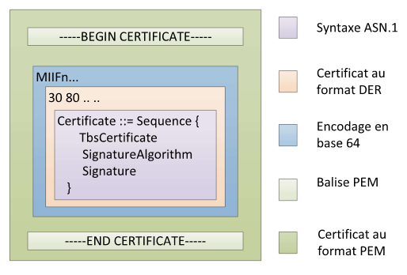
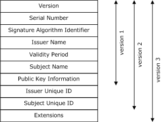
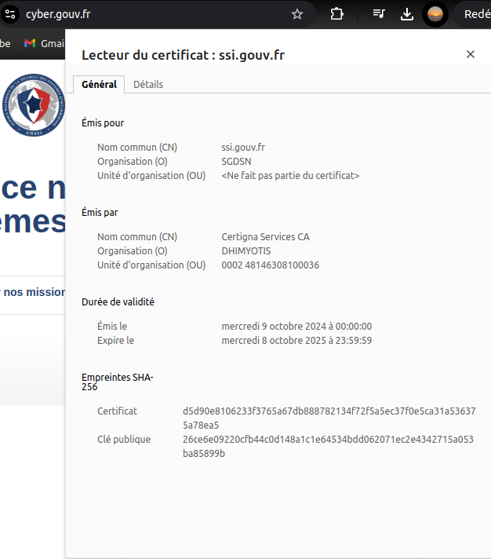
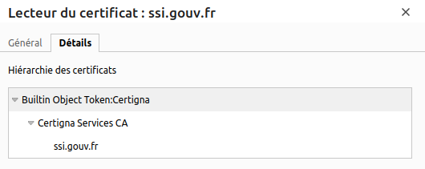
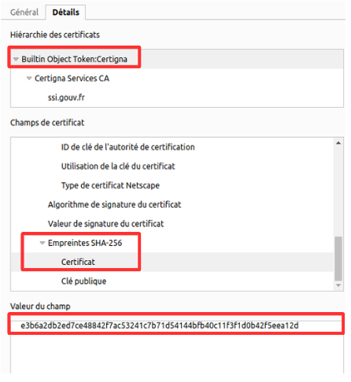
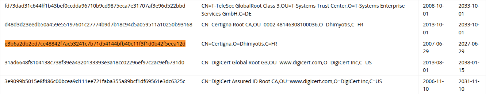

# Certificats X.509

# Introduction aux certificats X.509

    Le certificat X.509 est un document qui permet d'associer une identité (site web, personne, ...) à une clé publique. La clé publique permet de réaliser du chiffrement grâce à des algorithmes comme ECC ou RSA, pour lequel j'ai déjà dédié un petit article.

    C’est un élément fondamental de la PKI (Public Key Infrastructure), utilisé pour prouver qu’une clé publique appartient bien au bon détenteur.  

    Sans certificat, un attaquant pourrait générer une paire de clés et usurper l'identité de la cible réelle d'une requête (ex : Google.com, un serveur interne, ...). Le certificat X.509 vient résoudre ce problème en introduisant une preuve d’identité signée par une autorité de confiance (CA pour Certificate Authority).

    Dans cet article, nous nous attacherons au contenu et à l'utilisation du certificat X.509.

[Introduction à RSA](RSA.md)


## OpenSSL

L'outil le plus communément utilisé pour la génération de certificat en ligne de commande est **OpenSSL**. Nous l'utiliserons rapidement ici pour créer notre clé privée et notre certificat, mais vous pouvez trouver plus d'informations et d'exemples pratiques sur ce site :

[Introduction à OpenSSL](https://www.ssldragon.com/fr/how-to/openssl/)

## Création de la clé privée

```bash
$ openssl genrsa -out pv_key.key 2048
$ ls
pv_key.key
```

La commande ci-dessus permet de générer une clé privée **RSA**. La clé sera stockée dans le fichier `pv_key.key` et aura une taille de 2048 bits.


## Création du certificat

```bash
$ openssl req -new -x509 -key pv_key.key -out my_cert.crt -days 365
You are about to be asked to enter information that will be incorporated
into your certificate request.
What you are about to enter is what is called a Distinguished Name or a DN.
There are quite a few fields but you can leave some blank
For some fields there will be a default value,
If you enter '.', the field will be left blank.
-----
Country Name (2 letter code) [AU]:FR
State or Province Name (full name) [Some-State]:Bretagne
Locality Name (eg, city) []:Lannion
Organization Name (eg, company) [Internet Widgits Pty Ltd]:MyBigCompany
Organizational Unit Name (eg, section) []:IT-Security
Common Name (e.g. server FQDN or YOUR name) []:www.mybigcompany.com
Email Address []:Alice.mybigcompany.com
$
$ ls
my_cert.crt  pv_key.key
```

**Explications des options :**

- `openssl req` : permet de créer une demande de certificat ou CSR (Certificate Signing Request).  
- `-new` : indique que l'on veut créer un nouveau CSR.  
- `-x509` : permet de générer un certificat X.509 auto-signé. Sans cette option, il faudrait l'envoyer à une Autorité de Certification (CA) pour qu'elle le signe.  
- `-key pv_key.key` : la clé privée a un double usage :
  - La clé publique qui sera présente dans le certificat est dérivée à partir de cette clé privée.
  - Dans notre cas, le certificat est auto-signé grâce à cette même clé privée.
- `-out my_cert.crt` : nom du fichier de sortie où sera enregistré le certificat.  
- `-days 365` : durée de validité du certificat en jours.

> Des durées trop courtes impliquent des renouvellements fréquents.  
> Des durées trop longues augmentent le risque en cas de compromission de la clé privée.


En plus des options, certaine entrées clavier sont demandées à l'éxécution de la commande  : 


- **Country Name (C)** (FR) : Deux lettres [ISO 3166](https://en.wikipedia.org/wiki/List_of_ISO_3166_country_codes) 
- **State or Province Name (ST)**  (Bretagne)  
- **Locality Name (L)**  (Lannion)
- **Organization Name (O)** (MyBigCompany) : Nom de l’entreprise ou organisme.  
- **Organizational Unit Name (OU)** (IT-Security) : Département ou service dans l'entreprise
- **Common Name (CN)** (www.mybigcompany.com) : C'est le champ le plus important :  
  - Pour un serveur web, son [FQDN](https://kinsta.com/knowledgebase/fully-qualified-domain-name)  
  - Pour un utilisateur, son nom 
- **Email Address** (Alice.mybigcompany.com)

Nous avons maintenant notre propre certificat auto signé ! Vo
yons son contenu.


## Lecture du certificat

```bash
$ cat my_cert.crt 
-----BEGIN CERTIFICATE-----
MIIELTCCAxWgAwIBAgIUVOX0/p3whpI9eTt1F2Trl7BCaZswDQYJKoZIhvcNAQEL
BQAwgaUxCzAJBgNVBAYTAkZSMREwDwYDVQQIDAhCcmV0YWduZTEQMA4GA1UEBwwH
TGFubmlvbjEVMBMGA1UECgwMTXlCaWdDb21wYW55MRQwEgYDVQQLDAtJVC1TZWN1
cml0eTEdMBsGA1UEAwwUd3d3Lm15YmlnY29tcGFueS5jb20xJTAjBgkqhkiG9w0B
CQEWFkFsaWNlLm15YmlnY29tcGFueS5jb20wHhcNMjUwOTE0MTU1NjAxWhcNMjYw
OTE0MTU1NjAxWjCBpTELMAkGA1UEBhMCRlIxETAPBgNVBAgMCEJyZXRhZ25lMRAw
DgYDVQQHDAdMYW5uaW9uMRUwEwYDVQQKDAxNeUJpZ0NvbXBhbnkxFDASBgNVBAsM
C0lULVNlY3VyaXR5MR0wGwYDVQQDDBR3d3cubXliaWdjb21wYW55LmNvbTElMCMG
CSqGSIb3DQEJARYWQWxpY2UubXliaWdjb21wYW55LmNvbTCCASIwDQYJKoZIhvcN
AQEBBQADggEPADCCAQoCggEBAJ0wnVcydIF/qRO4xhVgnANw/hTJhHAvAMhIo4GZ
MvLtLbNEAtWKiBFjpakKyY4ir57QybVxFtb7sD6591mFcSw+4Wnl1M+n400U1/pD
xVXOSW7G9OwS8RuokP8CKSRPC5J/Wnd9c9a4dPxHuwm+Kz9g3QZ4T4FC/fMYCB+K
EVKUMwr8TjGjzLQckj/PJ3ruaHx+SHp7H7OWI8+hhtN7VmegDLN6yLA//GJWsEyR
ESOdd5s2EsuTBWpdooa5SNRb+CfS/cMvMU9L26glsLJe47VVR6yKsvc6hbAIsBCm
PpKrZ3Lj/Xk/kK/EjADrj/ML2zgRxBKplHtvHrBs0dAHbH0CAwEAAaNTMFEwHQYD
VR0OBBYEFDv/L5eCG6usSWt0F1zdMXLdupQoMB8GA1UdIwQYMBaAFDv/L5eCG6us
SWt0F1zdMXLdupQoMA8GA1UdEwEB/wQFMAMBAf8wDQYJKoZIhvcNAQELBQADggEB
ADGXAqIyG8eX/xBnpI617M7h8RUAEAAHkPFVvm3G1AeUIMsn/jX2HS0Awp4a90/5
tLnbyPxUxNHdNLonh6ktWur52pg9FEmu29uDek32EWymlSqCr7o3i6dGN3jrTIi6
5663tiZJrLlWjQzmoblFHariTvSdvJtqGJThisRuX3fVvAnCmBbnnDvvSkfgHQnS
3SQwrU/wJfC/8V7pMloXx+b4YtQ9yPIQanqnqmP0xh6/lUI1ZFF2VgX0Bo59tUwr
iccJhE0FGKOPJU9lnQhgP0gUFVV+wKefiRVqjMmPvd/W8n+yWW1RCsmNgTtQ1J43
CdtTyc76fJLkiy7YJOAHWno=
-----END CERTIFICATE-----
```

Le certificat X.509 est au format **PEM**. 


https://cryptobourrin.wordpress.com/2014/07/16/les-certificats-x-509/

Pour le lire en format texte :

```bash
$ openssl x509 -in my_cert.crt -text -noout
Certificate:
    Data:
        Version: 3 (0x2)
        Serial Number:
            54:e5:f4:fe:9d:f0:86:92:3d:79:3b:75:17:64:eb:97:b0:42:69:9b
        Signature Algorithm: sha256WithRSAEncryption
        Issuer: C = FR, ST = Bretagne, L = Lannion, O = MyBigCompany, OU = IT-Security, CN = www.mybigcompany.com, emailAddress = Alice.mybigcompany.com
        Validity
            Not Before: Sep 14 15:56:01 2025 GMT
            Not After : Sep 14 15:56:01 2026 GMT
        Subject: C = FR, ST = Bretagne, L = Lannion, O = MyBigCompany, OU = IT-Security, CN = www.mybigcompany.com, emailAddress = Alice.mybigcompany.com
        Subject Public Key Info:
            Public Key Algorithm: rsaEncryption
                Public-Key: (2048 bit)
                Modulus:
                    00:9d:30:9d:57:32:74:81:7f:a9:13:b8:c6:15:60:
                    9c:03:70:fe:14:c9:84:70:2f:00:c8:48:a3:81:99:
                    32:f2:ed:2d:b3:44:02:d5:8a:88:11:63:a5:a9:0a:
                    c9:8e:22:af:9e:d0:c9:b5:71:16:d6:fb:b0:3e:b9:
                    f7:59:85:71:2c:3e:e1:69:e5:d4:cf:a7:e3:4d:14:
                    d7:fa:43:c5:55:ce:49:6e:c6:f4:ec:12:f1:1b:a8:
                    90:ff:02:29:24:4f:0b:92:7f:5a:77:7d:73:d6:b8:
                    74:fc:47:bb:09:be:2b:3f:60:dd:06:78:4f:81:42:
                    fd:f3:18:08:1f:8a:11:52:94:33:0a:fc:4e:31:a3:
                    cc:b4:1c:92:3f:cf:27:7a:ee:68:7c:7e:48:7a:7b:
                    1f:b3:96:23:cf:a1:86:d3:7b:56:67:a0:0c:b3:7a:
                    c8:b0:3f:fc:62:56:b0:4c:91:11:23:9d:77:9b:36:
                    12:cb:93:05:6a:5d:a2:86:b9:48:d4:5b:f8:27:d2:
                    fd:c3:2f:31:4f:4b:db:a8:25:b0:b2:5e:e3:b5:55:
                    47:ac:8a:b2:f7:3a:85:b0:08:b0:10:a6:3e:92:ab:
                    67:72:e3:fd:79:3f:90:af:c4:8c:00:eb:8f:f3:0b:
                    db:38:11:c4:12:a9:94:7b:6f:1e:b0:6c:d1:d0:07:
                    6c:7d
                Exponent: 65537 (0x10001)
        X509v3 extensions:
            X509v3 Subject Key Identifier: 
                3B:FF:2F:97:82:1B:AB:AC:49:6B:74:17:5C:DD:31:72:DD:BA:94:28
            X509v3 Authority Key Identifier: 
                3B:FF:2F:97:82:1B:AB:AC:49:6B:74:17:5C:DD:31:72:DD:BA:94:28
            X509v3 Basic Constraints: critical
                CA:TRUE
    Signature Algorithm: sha256WithRSAEncryption
    Signature Value:
        31:97:02:a2:32:1b:c7:97:ff:10:67:a4:8e:b5:ec:ce:e1:f1:
        15:00:10:00:07:90:f1:55:be:6d:c6:d4:07:94:20:cb:27:fe:
        35:f6:1d:2d:00:c2:9e:1a:f7:4f:f9:b4:b9:db:c8:fc:54:c4:
        d1:dd:34:ba:27:87:a9:2d:5a:ea:f9:da:98:3d:14:49:ae:db:
        db:83:7a:4d:f6:11:6c:a6:95:2a:82:af:ba:37:8b:a7:46:37:
        78:eb:4c:88:ba:e7:ae:b7:b6:26:49:ac:b9:56:8d:0c:e6:a1:
        b9:45:1d:aa:e2:4e:f4:9d:bc:9b:6a:18:94:e1:8a:c4:6e:5f:
        77:d5:bc:09:c2:98:16:e7:9c:3b:ef:4a:47:e0:1d:09:d2:dd:
        24:30:ad:4f:f0:25:f0:bf:f1:5e:e9:32:5a:17:c7:e6:f8:62:
        d4:3d:c8:f2:10:6a:7a:a7:aa:63:f4:c6:1e:bf:95:42:35:64:
        51:76:56:05:f4:06:8e:7d:b5:4c:2b:89:c7:09:84:4d:05:18:
        a3:8f:25:4f:65:9d:08:60:3f:48:14:15:55:7e:c0:a7:9f:89:
        15:6a:8c:c9:8f:bd:df:d6:f2:7f:b2:59:6d:51:0a:c9:8d:81:
        3b:50:d4:9e:37:09:db:53:c9:ce:fa:7c:92:e4:8b:2e:d8:24:
        e0:07:5a:7a


```


Le certificat contient plusieurs champs, certains que l'on retrouve dans tout les certificats x.509, d'autre spécifique à la version du certificat.



Détails des champs : 


- **Version :** `(0x2)` : Version du certificat X.509, ici 3
- **Serial Number :** `54:e5:f4:fe:9d:f0:86:92:3d:79:3b:75:17:64:eb:97:b0:42:69:9b` : Identifiant unique du certificat
- **Signature Algorithm :** `sha256WithRSAEncryption` : Le certificat est signé avec SHA-256 et une clé RSA.
- **Issuer :** `C = FR, ST = Bretagne, L = Lannion, O = MyBigCompany, OU = IT-Security, CN = www.mybigcompany.com, emailAddress = Alice.mybigcompany.com  `
  Ce sont les informations sur l’autorité de certification. Ici, il est auto-signé donc l'émetteur est aussi le sujet
- **Not Before :** `Sep 14 15:56:01 2025 GMT  `
- **Not After :** `Sep 14 15:56:01 2026 GMT`  
  => Durée de validité : 1 an.
- **Subject :** `C = FR, ST = Bretagne, L = Lannion, O = MyBigCompany, OU = IT-Security, CN = www.mybigcompany.com, emailAddress = Alice.mybigcompany.com` : Informations sur l’entité possédant le certificat.
- **Public Key Algorithm :** `rsaEncryption  `
- **Key size :** `2048 bits ` 
- **Modulus et Exponent :**  
  - Modulus : `(2048 bits)` : La clé publique RSA.  
  - Exponent : `65537 (0x10001)` : Exposant public standard pour RSA.
- **Subject Key Identifier :** Identifiant unique pour la clé publique du sujet.  
- **Authority Key Identifier :** Identifiant unique pour la clé publique de l’autorité de certification. On retrouve logiquement la même valeur que pour le sujet (auto-signé)
- **Basic Constraints :** `CA:TRUE` : Indique si le certificat est autorité de certification (CA) ou non. Avec `CA:TRUE`, Ce certificat peut signer d'autres certificats, donc c’est un certificat racine ou intermédiaire dans une chaîne de confiance. La mention `critical` signifie que ce champ est obligatoire à prendre en compte lors de la validation du certificat. Par exemple si une application ne comprend pas ce champ, la validation doit échouer.

- **Signature Algorithm:  :** `sha256WithRSAEncryption` : indique 'algorythme utilisé pour signer la certificat.
- **Signature Value  :** : C'est la signature du certificat réalisée par l'autorité grâce à sa clé privée. Elle permet de vérifier l'intégrité du certificat et l'authenticité de son émetteur : si quelqu’un modifie le certificat, la signature ne correspondra plus à son contenu lorsqu’on la vérifie avec la clé publique de l’autorité.

Maintenant que nous avons créé notre certificat et que nous avons une clé privée associée, nous allons voir comment l'utiliser.

## Signer un message

Pour l'exemple nous allons créer un message texte, générer sa signature avec notre clé privée puis vérifier la signature à partir du message et de la clé publique présente dans le certificat : 

```bash
$ echo "Voici un message secret" > message.txt
```

Nous allons ensuite générer la signature du message : 

```bash
$ openssl dgst -sha256 -sign pv_key.key -out message.sig message.txt
```

Parfait, nous avons notre signature, maintenant pour déchiffrer cette signature nous avons besoin d'extraire la clé publique du certificat : 

```bash
$ openssl x509 -in my_cert.crt -pubkey -noout > cert_pubkey.pem
```

```bash
$ cat cert_pubkey.pem 
-----BEGIN PUBLIC KEY-----
MIIBIjANBgkqhkiG9w0BAQEFAAOCAQ8AMIIBCgKCAQEAnTCdVzJ0gX+pE7jGFWCc
A3D+FMmEcC8AyEijgZky8u0ts0QC1YqIEWOlqQrJjiKvntDJtXEW1vuwPrn3WYVx
LD7haeXUz6fjTRTX+kPFVc5Jbsb07BLxG6iQ/wIpJE8Lkn9ad31z1rh0/Ee7Cb4r
P2DdBnhPgUL98xgIH4oRUpQzCvxOMaPMtBySP88neu5ofH5Iensfs5Yjz6GG03tW
Z6AMs3rIsD/8YlawTJERI513mzYSy5MFal2ihrlI1Fv4J9L9wy8xT0vbqCWwsl7j
tVVHrIqy9zqFsAiwEKY+kqtncuP9eT+Qr8SMAOuP8wvbOBHEEqmUe28esGzR0Ads
fQIDAQAB
-----END PUBLIC KEY-----
```

Enfin, nous pouvons vérifier la signature : 

```bash
$ openssl dgst -sha256 -verify cert_pubkey.pem -signature message.sig message.txt
Verified OK
```

La signature est valide ! 

Cette signature est calculée à partir du haché du message, et sera donc valide uniquement si le message originel n'a pas été modifié. Tentons de le modifier et de re-signer.

```bash
$ echo "nouvelles data" > message.txt 
```

```bash
$ openssl dgst -sha256 -verify cert_pubkey.pem -signature message.sig message_mod.txt
Verification failure
806BE37EEF7F0000:error:02000068:rsa routines:ossl_rsa_verify:bad signature:../crypto/rsa/rsa_sign.c:430:
806BE37EEF7F0000:error:1C880004:Provider routines:rsa_verify:RSA lib:../providers/implementations/signature/rsa_sig.c:774:
```

Comme prévu, la vérification échoue


## Vérification de la signature d'un certificat 

Dans notre cas, le certificat est auto-signé, donc vérifier sa signature n'est pas très pertinent. Cependant, maintenant que nous avons compris comment fonctionne un certificat, nous pouvons essayer d'aller vérifier le certificat d'un serveur web, celui de l'ANSSI par exemple. Il est accessible via les paramètres à gauche de la barre des tâches.



Ce certificat nous donne des informations sur l'autorité certificatrice  `Certigna Services CA`. Nous pouvons retrouver la chaîne de certification du certificat. 



Cette chaîne de certification contient 3 niveaux : 

**Builtin Object Token : Certigna**

C’est la racine de confiance (Root CA). Elle est appelée `builtin` car elle est intégrée directement dans le navigateur, ou plus précisément dans le trust store du navigateur qui contient des certificats racine de confiance.

On peut par ailleurs effectuer cette vérification en repérant son empreinte (hash du certificat).



Puis en vérifiant qu'elle est bien présente dans le [trust store](https://chromium.googlesource.com/chromium/src/+/main/net/data/ssl/chrome_root_store/root_store.md) (parfois appelé root store) du navigateur, ici Google Chrome.




**Certigna Services CA :**

C’est une autorité intermédiaire (Intermediate CA). Son certificat est signé par la racine Certigna, et a pour rôle de signer des certificats pour des entités (comme l’ANSSI) sans exposer directement la racine.

Le certificat public de l'autorité doit nous permettre de vérifier la signature du certificat de l'ANSSI. Une fois avoir téléchargé les 2 certificats, on peut le faire grâce à une commande OpenSSL.

**ssi.gouv.fr**

C’est le certificat final (end-entity), celui utilisé par le serveur web que tu visites pour prouver son identité. Il contient le CN (Common Name) ou le SAN (Subject Alternative Name) correspondant au domaine et est signé par l’intermédiaire `Services Services CA`.

Pour vérifier manuellement la signature du certificat `ssi.gouv.fr` par Certigna Services CA, nous pouvons télécharger les 2 certificats puis utiliser OpenSSL : 

```bash
$ openssl verify -CAfile certigna.crt ANSSI.crt 
ANSSI.crt: OK
```

Nous avons bien pu vérifier la signature !
