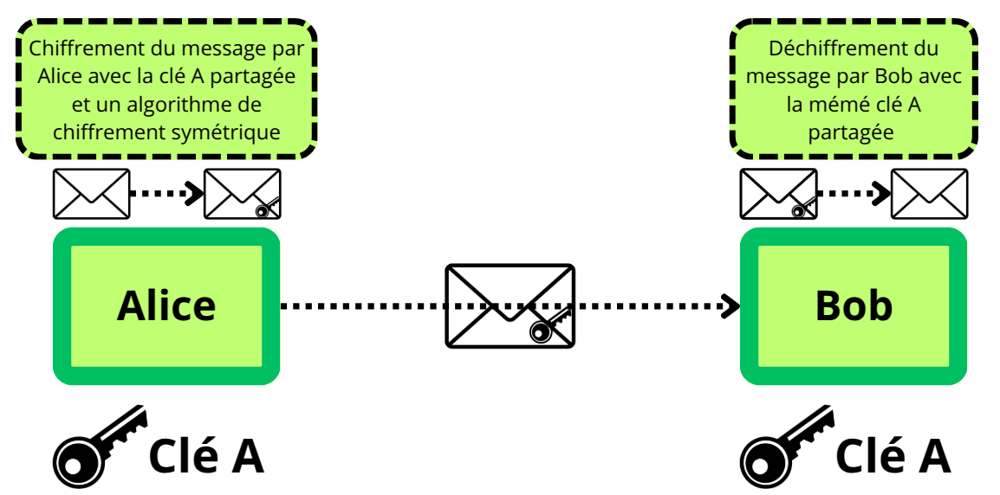
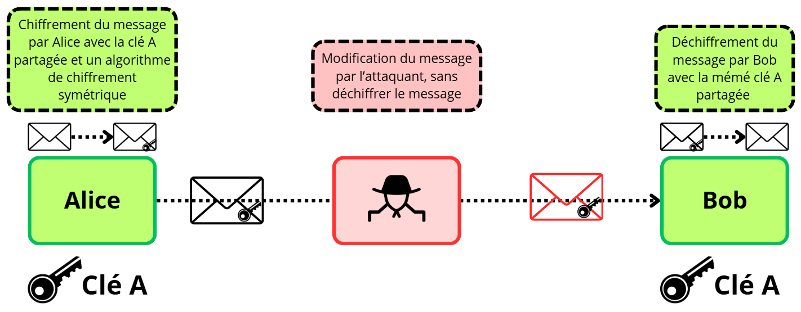
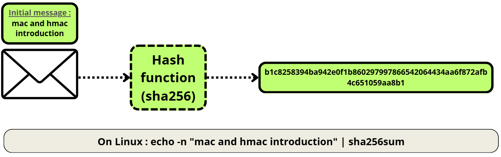
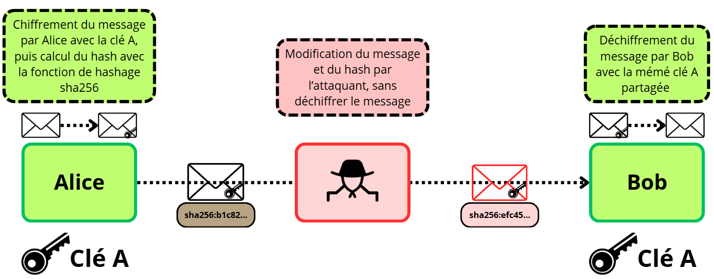
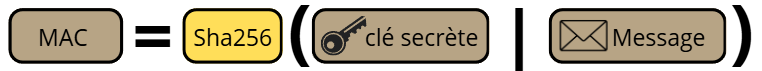
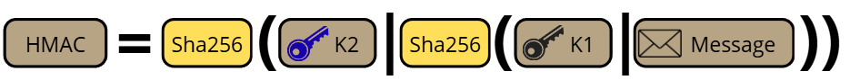

# MAC, HMAC et intégrité

## Introduction 
Les algorithmes de chiffrement d'aujourd'hui reposent sur 4 piliers : 

- Confidentialité
- **Intégrité**
- **Authenticité** 
- Non-répudiation

Le MAC, pour Message Authentication Code, est un processus qui permet de s'assurer **l'intégrité** (que le message n'a pas été modifié) et **l'authenticité** (que le message provient d'un interlocuteur légitime) d'un message en générant un hash à partir du message initial et d'une clé secrète. Dans cet article, nous verrons comment ce mécanisme a évolué, ses usages et son concept.

## Garantir l'intégrité

Dans le cas d'une session chiffrée entre 2 entités, les messages sont le plus généralement chiffrés par un algorithme symétrique. Ce chiffrement est précédé par la mise en place de cette session chiffrée, comme dans le cas du handshake TLS.


Durant l'échange de données, les communications sont donc chiffrées symétriquement par une clé partagée : 



L'intérêt du chiffrement symétrique est qu'il est beaucoup plus performant que le chiffrement asymétrique. Seulement, il ne permet pas la mise en place d'une signature numérique pour vérifier son intégrité, celle-ci étant réalisée à partir de la clé privée de l'expéditeur.

(Dans le chiffrement symétrique, il n'y a pas de concept de clé privée ou clé publique, simplement une clé partagée entre les 2 entités)

Dans le schéma ci-dessus, rien n'empêche un attaquant qui aurait un contrôle partiel du réseau d'altérer le message, même s'il n'a pas accès à son contenu, et que sa **confidentialité** est préservée. Sans mécanisme de vérification d'intégrité, le destinataire ne peut pas savoir si le message qu'il a reçu est bien celui qui a été envoyé. 



Sur le schéma ci-dessus, un attaquant a intercepté un message, l'a altéré puis renvoyé au destinataire. L'attaque a réussi. 

Il faut donc trouver un mécanisme pour que le destinataire puisse vérifier que le message n'a pas été altéré. 

### Le hash
Le hash est une première réponse apportée pour le contrôle d'intégrité. Pour rappel, une fonction de hachage permet de générer une chaîne de longueur fixe selon l'algorithme utilisé, dont il n'est pas possible d'extraire d'information sur l'information initiale. Une fonction de hachage par définition donnera toujours la même sortie pour la même entrée.



Une première idée pour vérifier l'intégrité d'un message serait de chiffrer l'information initiale, en extraire le hash puis envoyer le hash et le message chiffré au destinataire. Le destinataire n'aurait plus qu'à calculer le hash du message et vérifier qu'il correspond bien à celui calculé par l'expéditeur. 

Mais on voit tout de suite le problème de cette méthode. L'attaquant n'aurait qu'à modifier le message, recalculer le hash lui-même puis envoyer le message modifié et le nouveau hash au destinataire. 



Il faut donc trouver une solution pour que l'attaquant ne puisse pas chiffrer lui-même le message modifié. 

### Le MAC

C'est là que le MAC intervient. Dans la construction du MAC, une clé secrète est utilisée. 

La fonction de hachage (MD5, SHA1, SHA256, etc.) est ensuite effectuée sur la clé secrète concaténée au message pour donner le MAC. 




Prenons un exemple concret : 

Le message que l'on souhaite chiffrer est `secret`, la clé est `key`. Cette clé peut par exemple être dérivée à partir du `premaster secret` de la session TLS.

La concaténation des 2 est donc `secretkey`

```bash
binary(secret) = 01110011 01100101 01100011 01110010 01100101 01110100

binary(key) = 01101011 01100101 01111001 

binary(keysecret) = 01101011 01100101 01111001 01110011 01100101 01100011 01110010 01100101 01110100 
```

Comme on a : 

```
MAC = H(K || M)
```

Le MAC est donc : `sha256(keysecret)` (avec sha-256 comme fonction de hachage)

sha256(keysecret)=`d6ff67573947d391ee2589b6a3534a3b300a1c6105acd079b9745b37bd9e4260`

Si un attaquant intercepte la requête et la modifie, il ne pourra pas calculer le MAC sans avoir la clé secrète. 

En principe ! Car une vulnérabilité a vite été détectée sur ce type
de MAC (appelé aussi `naive MAC`) nommé `length extension attack`.

Cette attaque permet à un attaquant de calculer le MAC d'un message modifié, en utilisant le MAC du message original si celui-ci a été calculé avec une fonction de hachage qui utilise la construction de [Merkle-Damgard](https://en.wikipedia.org/wiki/Merkle%E2%80%93Damg%C3%A5rd_construction)

Pour comprendre cette attaque, le mieux est de la réaliser alors j'ai créé 
un script python qui reproduit la fonction de hachage SHA256 et qui prend en
argument les 8 valeurs initiales sur lesquelles se base SHA256 pour
calculer le hash final.


Lien de mon repository github : [Length Extension Attack](https://github.com/T2an/scratch_sha256)

L'attaque est très bien expliquée dans ces 2 ressources, alors que je 
ne la réexpliquerai pas entièrement ici.

Article qui explique l'attaque : [Length Extension Attack](https://www.cryptologie.net/posts/how-did-length-extension-attacks-made-it-into-sha-2/)

Vidéo Youtube :  [Length Extension Attack](https://www.youtube.com/watch?v=orIgy2MjqrA)

### HMAC

Pour pallier à cette vulnérabilité la solution est [HMAC](https://datatracker.ietf.org/doc/html/rfc2104) (Hash-based Message Authentication Code). 

Plutôt que d'utiliser une simple concaténation de la clé et du message comme pour le MAC, HMAC utilise la formule suivante :



C'est assez similaire au MAC, seulement, HMAC se base sur 2 clés secrètes K1 et K2 différentes, dérivées du même `premaster secret`. 

- HMAC commence par réaliser la même opération que pour le MAC, c'est-à-dire concaténer K1 et M puis appliquer la fonction de hachage. 

- Puis concatène K2 et le résultat de la fonction de hachage 

- Et applique la fonction de hachage une nouvelle fois.

Ainsi, l'état interne durant la première fonction est impossible à récupérer, et l'attaque par length extension n'est plus possible.


### Utilisation HMAC 

HMAC est largement déployé, il est notamment utilisé dans des protocoles comme IPsec, SSH et TLS 1.2 ou encore dans les JSON Web Token (JWT).

### Alternatives à HMAC

Il existe de nombreuses alternatives à HMAC, comme les autres constructions de MAC [CMAC](https://en.wikipedia.org/wiki/CMAC),  [GMAC](https://en.wikipedia.org/wiki/GMAC), [KMAC](https://en.wikipedia.org/wiki/KMAC) ou encore le [HMAC-DRBG](https://en.wikipedia.org/wiki/HMAC-DRBG). 

D'autres solutions de vérification d'intégrité sont directement intégrées au chiffrement authentifié, on les nomme AEAD (Authenticated Encryption with Associated Data). On peut citer dans cette catégorie le [GCM](https://en.wikipedia.org/wiki/Galois/Counter_Mode), [ChaCha20-Poly1305](https://en.wikipedia.org/wiki/ChaCha20-Poly1305) ou [AES-CCM](https://en.wikipedia.org/wiki/CCM_mode). TLS 1.3 n'utilise plus que ces solutions pour gérer l'intégrité et l'authenticité des messages.


