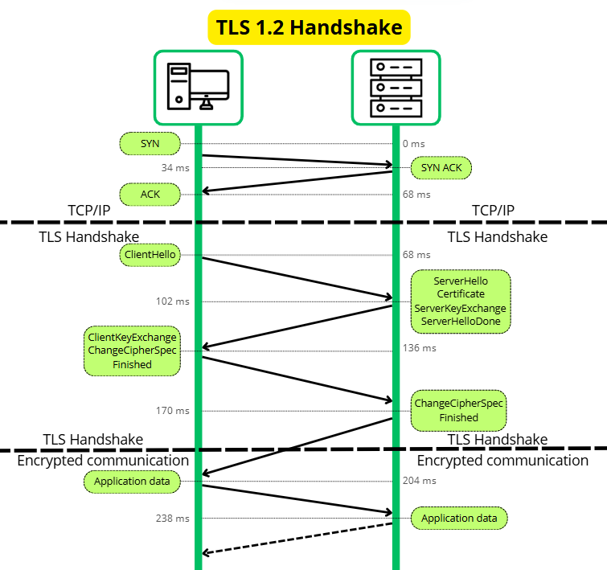

# MAC, HMAC et intégrité

## Introduction 
Les algorythmes de chiffrement aujourd'hui repose sur 4 pilliers : 

- Confidentialité
- **Intégrité**
- **Authenticité** 
- Non-répudiation

Le MAC, pour Message Authentication Code, est un processus qui permet s'assurer **l'intégrité** (que le message n'a pas été modifié) et **l'authenticité** (que le message provient d'un l'interlocuteur légitime) d'un message en générant un hash à partir du message initial et d'une clé secrete. Dans cette article, nous verront comment ce mécanisme à évoluer, ses usages et son concept.

## Garantir l'intégrité

Dans le cas d'une session chiffré entre 2 entités, les messages sont le plus généralement chiffré par un algorythme symétrique. Ce chiffrement est précédé par la mise en place de cette session chiffré, comme dans le cas du handshake TLS.



Durant l'échange de données, les communications sont donc chiffrés symétriquement par une clé partagé : 


L'interet du chiffrement symétrique est qu'il est beaucoup plus performant que le chiffrement asymétrique. Seulement, il ne permet pas la mise en place d'une signature numérique pour vérifier son intégrité, celle-ci étant réalisées à partir de la clé privée de l'expediteur.

(Dans le chiffrement symétrique, il n'y a pas de concept de clé privée ou clé publique, simplement une clé partagé entre les 2 entités)

Dans le schéma ci-dessus, rien n'empeche un attaquant qui aurait un control partiel du réseau d'alterer le message, meme si il n'a pas accès à son contenu, et que sa **confidentialité** est préservée. Sans mécanisme de vérification d'intégrité, le destinataire de peut pas savoir si le message qu'il a recu est bien celui a qui été envoyé. 


Sur le schéma ci-dessus, un attaquant a intercepté un message, l'a altéré puis renvoyé au destinataire. L'attaque à réussie. 

Il faut donc trouver un mécanisme pour que le destinataire puisse vérifier que le message n'a pas été altéré. 

Le hash est une premiere réponse apporté pour le control d'intégrité. Pour rappel, une fonction de hashage permet de généré une string de longueur fixe selon l'algorithme utilisé, dont il n'est pas possible d'extraire d'information sur l'information initial. Une fonction de hashage par définition donnera toujours la meme sortie pour la meme entrée.


Une premiere idée pour vérifier l'intégrité d'un message serait de chiffrer l'information initiale, en extraire le hash puis envoyer le hash et le message chiffré au destinataire. Le destinataire n'aurait plus qu'a calculer le hash du message et vérifier qu'il correspond bien à celui calculé par l'expéditeur. 

Mais on voit tout de suite le probleme de cette méthode. L'attaquant n'aurait qu'a modifier le message, recalculer le hash lui meme puis envoyer le message modifié et le nouveau hash au destinataire. 


Il faut donc trouvé une solution pour que l'attaquant ne puisse pas chiffrer lui meme le message modifié. 

C'est la que le MAC intervient. Dans la construction du MAC, une clé secrete (dérivé du meme `premaster secret` que pour la clé de session) est utilisé. 

La fonction de hash est effectué sur la clé secrete concaténé au message


Prenons un exemple concret : 

Le message que l'on souhaite chiffré est `secret`, la clé est `key`. La concaténation des 2 est donc `secretkey`

```bash
binary(secret) = 01110011 01100101 01100011 01110010 01100101 01110100

binary(key) = 01101011 01100101 01111001 

binary(keysecret) = 01101011 01100101 01111001 01110011 01100101 01100011 01110010 01100101 01110100 
```

Le mac final est donc : `sha256(keysecret)`