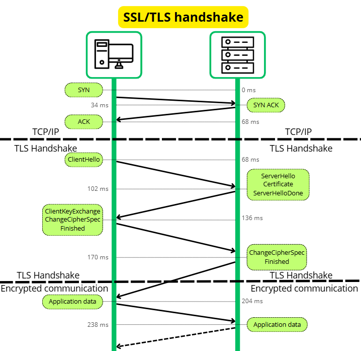
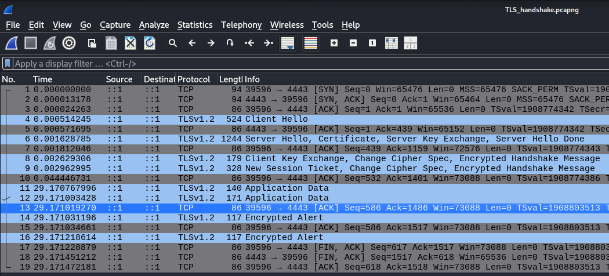
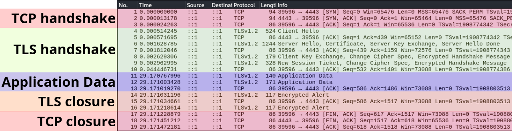

# Analyse de trames TLS

## Introduction à TLS (Transport Layer Security)

TLS, (`Transport Layer Security`), est un protocole qui permet de sécuriser des communications. Il a été standardisée en janvier 1999 par l’IETF dans le [RFC 2246](https://datatracker.ietf.org/doc/html/rfc2246) et a été créé pour garantir : 

- La **confidentialité** : Chiffrement des données échangées entre le client et le serveur

- L'**Intégrité** : Vérifier que les messages n’ont pas été modifiés pendant la transmission.

- L'**Authentification** : Le serveur peut être identifié à l’aide de certificats numériques (voir [certificat X.509](certificat_x509))

*Petite clarification :  TLS est l’évolution de SSL (Secure Sockets Layer), un protocole plus ancien désormais obsolète., on parle souvent de “SSL/TLS”, mais aujourd’hui, c’est TLS qui est systématiquement utilisé.*
 
TLS est le utilisé par [HTTPS](https://fr.wikipedia.org/wiki/Hypertext_Transfer_Protocol_Secure) pour naviguer sur des sites web de manière sécurisée,  mais il est également utilisé pour sécuriser les APIs REST, les [WebSockets sécurisés (wss://)](https://http.dev/wss), les protocoles de messagerie comme SMTP, IMAP et [POP3S](https://fr.wikipedia.org/wiki/Post_Office_Protocol), certains VPN comme [OpenVPN](https://openvpn.net/as-docs/tls-control-channel.html) et d’autres services comme [FTPS](https://en.wikipedia.org/wiki/FTPS) et [LDAPS](https://jumpcloud.com/blog/ldap-vs-ldaps).

## Analyse de TLS

Lorsqu'un client (navigateur, application) se connecte à un serveur TLS il initie un `Handshake`. Durant ce handshake, le client et le serveur négocient les paramètres cryptographiques (algorithmes de chiffrement, clés, etc.), le client authentifie le serveur et génère un secret, nommé "pre-master secret", qui sera dérivé pour créer une session symétrique. Cette clé sera utilisée pour chiffrer les données échangées entre lui et le serveur. 

### Détail de l'échange

Dans la suite de cette section, nous allons détailler l'échange présenté dans le schéma ci-dessous.

 

Nous allons analyser l'échange de manière pratique en créant un serveur TLS, des certificats et un client. Nous observerons l'échange avec wireshark. A noter que nous allons commencer par l'étude de TLS 1.2, qui est plus simple à analyser que TLS 1.3 car le handshake se déroule en clair. 

### Mise en place d'un serveur TLS


Nous avons donc besoin :

D'une CA

```bash
$ openssl genrsa -out ca.key 2048
$ openssl req -x509 -new -nodes -key ca.key -sha256 -days 365 -out ca.crt -subj "/CN=MyCA"
```

D'un certificat pour le serveur, signé par la CA

```bash
$ openssl genrsa -out server.key 2048
$ openssl req -new -key server.key -out server.csr -subj "/CN=localhost"
$ openssl x509 -req -in server.csr -CA ca.crt -CAkey ca.key -CAcreateserial -out server.crt -days 365 -sha256
```

D'éxécuter le serveur (ici, nous spécifions que nous voulons utiliser TLS 1.2)

```bash
$ openssl s_server -accept 4443 -cert server.crt -key server.key -HTTP -tls1_2
```

On peut meme creer un fichier index.html que l'on requetera.

```bash
$ echo "Hello World" > index.html
```

==> *Lancement de la capture wireshark pour observer l'échange.*

Et de connecter un client à ce serveur.

```bash
$ openssl s_client -connect localhost:4443 -CAfile ca.crt
$ GET /index.html HTTP/1.1
```

### Observation de l'échange

Nous pouvons observer l'échange dans wireshark.



On peut distinguer 5 étapes :



Nous ne nous interesserons pas à la mise en place et à la fermeture du canal
TCP.

### TLS handshake

Le TLS handshake à pour objectif pour le client et le serveur de se mettre d'accord sur les parametres de la session de données qui suivra ()
Le TLS handshake se déroule en 2 phases :


#### ClientHello

Dans le clientHello, le client envoie 5 informations importantes :

- La version de TLS la plus élévée que le client supporte. (TLS Version)
- Un nombre aléatoire de 32 octets(Random) 
- Un ID de session de 32 octets (Session ID). Il peut etre vide, ce qui signifie que le client ne souhaite pas réutiliser une session précédente et démarre une nouvelle session.
- Les suites cryptographiques que le client supporte, symétrique et asymétrique (Cipher Suites)
- Les extensions que le client supporte et veut inclure à cette session (Extensions)


### ServerHello

Dans le ServerHello, le serveur envoie le meme 5 informations que le clientHello :

- La version la plus élévée que le serveur supporte
- Un nombre aléatoire de 32 octets 
- Un ID de session de 32 octets (Session ID). Ici il vaut 0, ce qui signifie que le serveur ne souhaite pas réutiliser une session précédente et démarre donc une nouvelle session.
- La suite cryptographique choisie par le serveur. La suite chosis dans notre cas est  `TLS_ECDHE_RSA_WITH_AES_256_GCM_SHA384`.
- Les extensions que le serveur veut aussi inclure à cette session


### Certificate

Le server envoie son certificat X.509 au client. Le client :

- Recupere la clé publique du serveur
- Verifie la signature du certificat avec la clé publique de la CA. Le certificat de la CA est présent dans sa liste de confiance (trusted root)

### Server Key Exchange

Ce message est envoyé que si le serveur choisis un algorythme de chiffrement symétrique du type Diffie-Hellman (DHE) ou ECDHE. C'est notre cas, on retrouve dans ce message le type et le nom de la courbe elliptique choisie, et la clé publique du serveur du cette courbe. 


### Server Hello Done

Le serveur indique qu'il a terminé de transmettre ses informations.

### Client Key Exchange

Le client envoie une clé de 48 octets nommé pre-master secret. Elle est transmise chiffrée part la clé publique du serveur.

# Créer client (pour MTLS)
openssl genrsa -out client.key 2048
openssl req -new -key client.key -out client.csr -subj "/CN=client"
openssl x509 -req -in client.csr -CA ca.crt -CAkey ca.key -CAcreateserial -out client.crt -days 365 -sha256


D'un certificat pour le client, signé par la CA

```bash
openssl genrsa -out client.key 2048
openssl req -new -key client.csr -out client.csr -subj "/CN=client"
openssl x509 -req -in client.csr -CA ca.crt -CAkey ca.key -CAcreateserial -out client.crt -days 365 -sha256

openssl s_client -connect localhost:4443 -CAfile ca.crt
```


https://www.youtube.com/watch?v=JA0vaIb4158